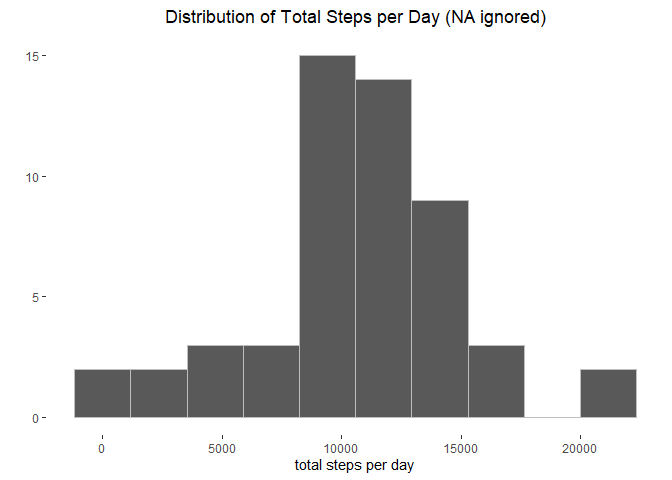
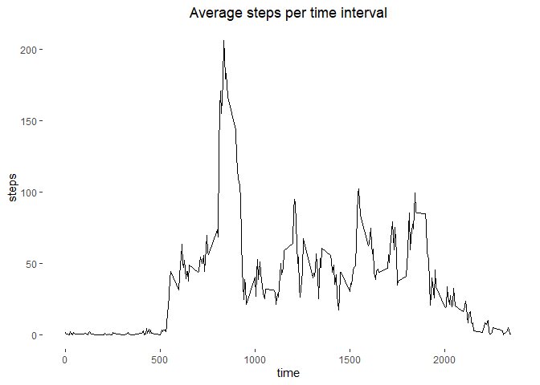
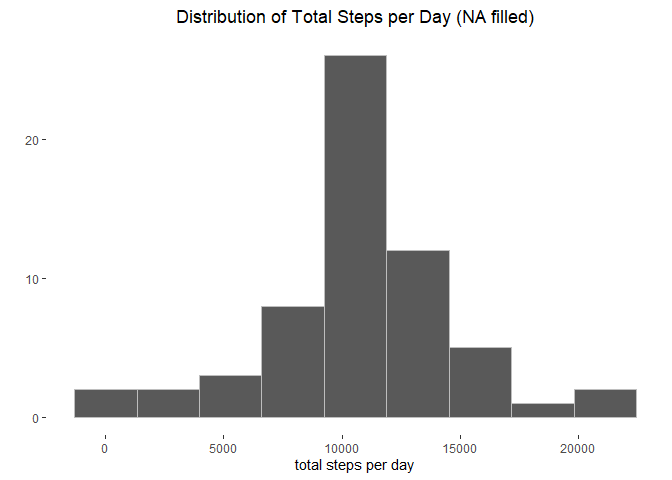
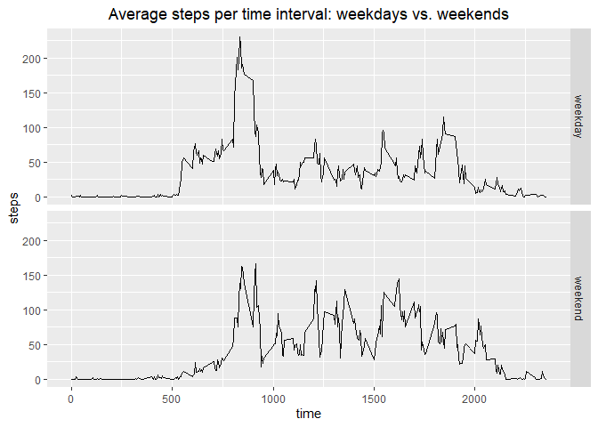

## Loading and preprocessing the data


```r
library(ggplot2)

Sys.setlocale("LC_TIME", "English")
```

```
## [1] "English_United States.1252"
```

```r
zip_filename = "repdata_data_activity.zip"
if(!file.exists(zip_filename)) {
  download.file("https://d396qusza40orc.cloudfront.net/repdata%2Fdata%2Factivity.zip", zip_filename)
} else {
  print("File already exists")
}

filename <- unzip(zip_filename)

if(!exists("activity")) {
    activity <- read.csv(filename)
}

head(activity)
```

```
##   steps       date interval
## 1    NA 2012-10-01        0
## 2    NA 2012-10-01        5
## 3    NA 2012-10-01       10
## 4    NA 2012-10-01       15
## 5    NA 2012-10-01       20
## 6    NA 2012-10-01       25
```

```r
summary(activity)
```

```
##      steps            date              interval     
##  Min.   :  0.00   Length:17568       Min.   :   0.0  
##  1st Qu.:  0.00   Class :character   1st Qu.: 588.8  
##  Median :  0.00   Mode  :character   Median :1177.5  
##  Mean   : 37.38                      Mean   :1177.5  
##  3rd Qu.: 12.00                      3rd Qu.:1766.2  
##  Max.   :806.00                      Max.   :2355.0  
##  NA's   :2304
```
## What is mean total number of steps taken per day?

Calculate the total number of steps taken per day

```r
steps_per_day <- aggregate(activity$steps, list(activity$date), sum)
colnames(steps_per_day) <- c("date", "steps")
steps_per_day <- steps_per_day[!is.na(steps_per_day$steps), ]
```
Make a histogram of the total number of steps taken each day

```r
ggplot(steps_per_day, aes(steps)) + geom_histogram(bins=10, col="grey") +
    xlab("total steps per day") +
    ylab("") +
    ggtitle(expression('Distribution of Total Steps per Day (NA ignored)')) +
    # scale_y_continuous(breaks=seq(0,18,2) +
   theme(plot.title = element_text(hjust = 0.5), panel.grid.minor = element_blank(),
         panel.background = element_blank())
```

<!-- -->
Calculate and report the mean and median of the total number of steps taken per day

```r
mean(steps_per_day$steps)
```

```
## [1] 10766.19
```

```r
median(steps_per_day$steps)
```

```
## [1] 10765
```

## What is the average daily activity pattern?

Make a time series plot of the 5-minute interval (x-axis) and the average number of steps taken, averaged across all days (y-axis)

```r
average_steps_per_interval <- aggregate(steps~interval, data=activity, FUN=mean, na.rm=TRUE)
ggplot(average_steps_per_interval, aes(interval, steps)) + geom_line() + 
           ggtitle("Average steps per time interval") +
           xlab("time") + 
           ylab("steps") +
           theme(plot.title = element_text(hjust = 0.5), panel.grid.minor = element_blank(),
                 panel.background = element_blank())
```

<!-- -->

Which 5-minute interval, on average across all the days in the dataset, contains the maximum number of steps?

```r
average_steps_per_interval[which.max(average_steps_per_interval[,2]),1]
```

```
## [1] 835
```

## Inputing missing values
Calculate and report the total number of missing values in the dataset

```r
sum(is.na(activity[,1]))
```

```
## [1] 2304
```

Devise a strategy for filling in all of the missing values in the dataset. 


```r
# Using the means of the 5-minute interval
na_activities <- is.na(activity$steps)
int_avg <- tapply(activity$steps, activity$interval, mean, na.rm=TRUE, simplify=T)
activity$steps[na_activities] <- int_avg[as.character(activity$interval[na_activities])]
```
Create a new dataset that is equal to the original dataset but with the missing data filled in.

```r
new_steps_per_day <-aggregate(activity$steps, list(activity$date), sum)
colnames(new_steps_per_day) <- c("date", "steps")
```
Make a histogram of the total number of steps taken each day. 

```r
ggplot(new_steps_per_day, aes(steps)) + geom_histogram(bins=9, col="grey") +
    xlab("total steps per day") +
    ylab("") +
    ggtitle(expression('Distribution of Total Steps per Day (NA filled)')) +
    # scale_y_continuous(breaks=seq(0,18,2) +
    theme(plot.title = element_text(hjust = 0.5), panel.grid.minor = element_blank(),
          panel.background = element_blank())
```

<!-- -->
Calculate and report the mean and median total number of steps taken per day.

```r
mean(new_steps_per_day$steps)
```

```
## [1] 10766.19
```

```r
median(new_steps_per_day$steps)
```

```
## [1] 10766.19
```
Do these values differ from the estimates from the first part of the assignment? 
R. The mean didn't changed att all

What is the impact of imputing missing data on the estimates of the total daily number of steps?
R. It looks more like a normal distribution

## Are there differences in activity patterns between weekdays and weekends?
Create a new factor variable in the dataset indicating whether a given date is a weekday or weekend day.


```r
activity$date <- as.Date(activity$date, format = "%Y-%m-%d")
activity$weekday <- weekdays(activity$date)
activity$type <- ifelse(activity$weekday=='Saturday' | activity$weekday=='Sunday', 'weekend', 'weekday')
head(activity)
```

```
##       steps       date interval weekday    type
## 1 1.7169811 2012-10-01        0  Monday weekday
## 2 0.3396226 2012-10-01        5  Monday weekday
## 3 0.1320755 2012-10-01       10  Monday weekday
## 4 0.1509434 2012-10-01       15  Monday weekday
## 5 0.0754717 2012-10-01       20  Monday weekday
## 6 2.0943396 2012-10-01       25  Monday weekday
```
Make a panel plot containing a time series plot of the 5-minute interval (x-axis) and the average number of steps taken, averaged across all weekday days or weekend days (y-axis).

```r
steps_per_day_type <- aggregate(steps~interval + type,data=activity,FUN=mean,na.action=na.omit)
ggplot(steps_per_day_type, aes(interval, steps)) +
  geom_line()  + 
  ggtitle("Average steps per time interval: weekdays vs. weekends")  + 
  xlab("time") + 
  ylab("steps") + 
  theme(plot.title = element_text(hjust = 0.5)) +
  facet_grid(type ~ .)
```

<!-- -->

